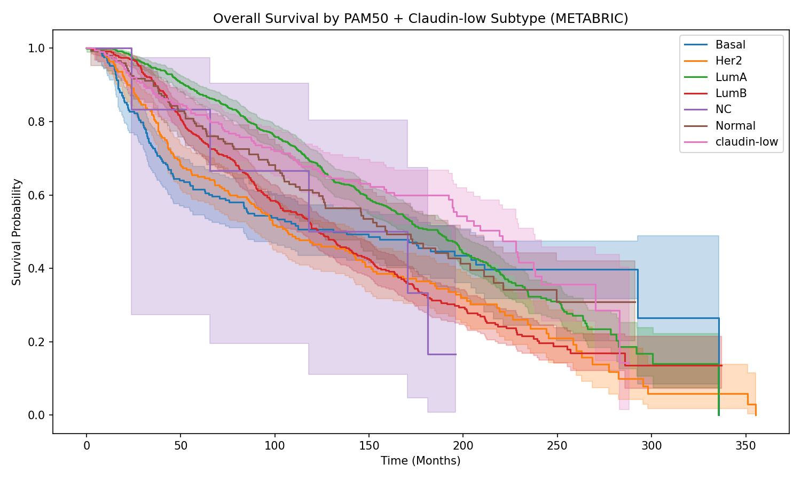
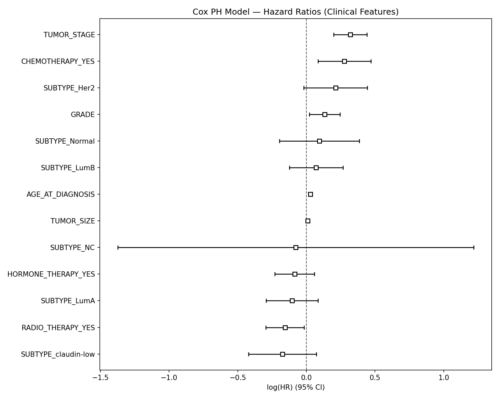
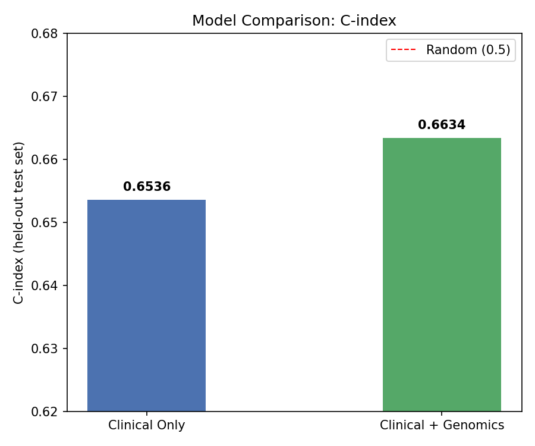

# Breast Cancer Survival & Risk Modelling

[](https://www.python.org/)
[](https://lifelines.readthedocs.io/)
[](https://scikit-learn.org/)
[](https://www.cbioportal.org/study/summary?id=brca_metabric)
[](LICENSE)
[]()

---

## Biological Question

What determines whether a breast cancer patient survives five years after diagnosis — and how much does the molecular identity of their tumour matter beyond clinical stage alone?

Breast cancer is not one disease. The same diagnosis can describe a slow-growing, hormone-driven tumour in a 60-year-old that responds readily to endocrine therapy, or an aggressive, triple-negative cancer in a 35-year-old that is resistant to standard treatment and carries a substantially worse prognosis. This heterogeneity is captured — imperfectly but usefully — by **molecular subtype classification**: the PAM50 gene expression signature divides breast cancers into Luminal A, Luminal B, HER2-enriched, and Basal-like subtypes, each with distinct biology, treatment response, and survival trajectory. A fifth subtype, Claudin-low, is characterised by stem-cell-like features and mesenchymal gene expression.

Survival prediction in breast cancer has historically relied on clinical variables — tumour size, lymph node involvement, histological grade, and hormone receptor status — that are measurable at diagnosis without genomic profiling. But as genome-scale expression data became available for large cohorts, the question arose: does the full transcriptomic landscape of a tumour contain survival-relevant information beyond what clinical staging already captures? And if so, how much?

This project answers that question directly using the **METABRIC cohort** (~2,000 patients with matched clinical and microarray expression data), building Cox proportional hazards models with and without genomic features and measuring the gain in predictive performance.

---

## Key Findings

> **Molecular subtype is the strongest prognostic stratifier. Gene expression adds modest but real predictive value beyond clinical features alone.**

1. **PAM50 subtype stratification reveals dramatically divergent survival trajectories.** Luminal A patients have the best long-term survival; Basal-like and Claudin-low subtypes show substantially worse outcomes, with steeper early mortality curves. This confirms that molecular classification captures survival-relevant biology that histological grade alone does not fully encode.

2. **Clinical features dominate survival prediction.** Age at diagnosis, tumour stage, and histological grade are the strongest independent predictors in the Cox model (all p < 0.005). This reflects decades of validated clinical knowledge — these variables were selected for clinical use precisely because they are prognostic.

3. **Integrating gene expression improves prediction, modestly but consistently.** Adding 50 principal components from 20,000+ gene expression features improves the held-out C-index from **0.6536 to 0.6634** (+0.0098). The gain is small in absolute terms but reproducible — suggesting that transcriptomic heterogeneity captures survival signal not fully encoded in standard clinical variables, particularly across the spectrum of molecular subtypes.

4. **The chemotherapy hazard ratio reflects indication bias, not a causal harm.** Cox HR = 1.32 for chemotherapy does not mean chemotherapy worsens survival. It means that chemotherapy is preferentially administered to higher-risk patients — those with larger, higher-grade, node-positive tumours — so its positive hazard ratio reflects the underlying disease severity, not the treatment effect. This is a classical confounding problem in observational survival analysis, and its presence here illustrates why randomised trial data are needed to establish causal treatment effects.

5. **The C-index improvement ceiling suggests targeted feature selection would outperform PCA.** Raw expression PCA captures global transcriptomic variance, not necessarily survival-relevant variance. Replacing the top 50 PCs with expression values of known prognostic genes (ESR1, ERBB2, TP53, MKI67, BRCA1) or a validated gene expression signature (Oncotype DX, Mammaprint) would likely yield a larger C-index gain.

---

## Clinical Relevance

This analysis connects directly to several active research priorities in breast cancer:

**Precision prognostication.** The finding that molecular subtype adds prognostic information beyond clinical staging is the scientific basis for genomic tests like Oncotype DX and Mammaprint, which are now standard of care for early-stage ER-positive breast cancer treatment decisions. Building survival models that integrate genomics is foundational work for extending this principle to other subgroups.

**Early-onset breast cancer.** The Schmidt Group (Netherlands Cancer Institute) and the HER-CARE network specifically study early-onset and hereditary breast cancer, where the distribution of molecular subtypes differs markedly from the general population — with higher proportions of Basal-like and HER2-enriched tumours. Survival modelling stratified by age at onset and molecular subtype is a direct methodological contribution to this research direction.

**Causal inference in observational data.** The chemotherapy confounding observed in the Cox model illustrates a fundamental challenge in cancer epidemiology: treatment effects estimated from observational cohorts are biased by treatment selection. Addressing this requires causal inference methods (propensity score adjustment, instrumental variables) — an active area of methodological development in cancer outcomes research.

---

## Dataset

**METABRIC (Molecular Taxonomy of Breast Cancer International Consortium)**

| Property | Details |
|---|---|
| **Source** | [cBioPortal](https://www.cbioportal.org/study/summary?id=brca_metabric) |
| **Original cohort** | 2,509 primary breast cancer patients |
| **After preprocessing** | 1,980 patients with complete clinical + genomic data |
| **Events (deceased)** | 1,144 / 1,981 patients (57.7% event rate) |
| **Expression platform** | Illumina microarray (20,603 genes) |
| **Publications** | Curtis et al. *Nature* 2012; Rueda et al. *Nature* 2019 |

The METABRIC cohort is one of the most comprehensively characterised breast cancer datasets in existence — with long follow-up, matched expression and clinical data, and PAM50 subtype classification — making it the reference standard for breast cancer survival modelling studies.

## Project Structure

```
Breast-Cancer-Survival-Risk-Model/
├── src/
│   ├── preprocessing.py            # Clinical data cleaning & feature engineering
│   ├── genomic_preprocessing.py    # mRNA expression PCA pipeline
│   └── survival_analysis.py        # KM curves, Cox model, C-index evaluation
├── data/
│   ├── raw/
│   │   ├── brca_metabric_clinical_data.tsv   # included in repo
│   │   ├── data_mrna_agilent_microarray.tsv  # included in repo
│   │   └── data_mrna_illumina_microarray.txt # NOT included — download separately
│   └── processed/
│       ├── metabric_merged.csv               # included (Step 1 output)
│       └── metabric_genomic_merged.csv       # NOT included — regenerate via Step 2
├── brca_metabric/                  # cBioPortal metadata & case lists (included)
├── outputs/
│   └── plots/
│       ├── km_by_subtype.png
│       ├── cox_forest_plot.png
│       └── cindex_comparison.png
├── requirements.txt
├── .gitignore
└── README.md
```

---

## Setup & Installation

### 1. Clone the repository

```bash
git clone https://github.com/g-Poulami/Breast-Cancer-Survival-Risk-Model.git
cd Breast-Cancer-Survival-Risk-Model
```

### 2. Install dependencies

```bash
pip install -r requirements.txt
```

### 3. Download the Illumina expression matrix

The clinical data and Agilent expression file are already included in the repo. Only the large Illumina expression matrix needs to be downloaded separately:

```bash
mkdir -p data/raw
cd data/raw
wget https://cbioportal-datahub.s3.amazonaws.com/brca_metabric.tar.gz
tar -xzf brca_metabric.tar.gz
cp brca_metabric/data_mrna_illumina_microarray.txt .
cd ../..
```

### 4. Run the pipeline

```bash
# Step 1: Clean clinical data
python src/preprocessing.py

# Step 2: Process gene expression (PCA) — requires the Illumina matrix from Step 3
python src/genomic_preprocessing.py

# Step 3: Run survival analysis and generate plots
python src/survival_analysis.py
```

> **Note:** `data/processed/metabric_merged.csv` is included in the repo so you can run `survival_analysis.py` directly without re-running Step 1. Step 2 requires the Illumina expression matrix and will regenerate `metabric_genomic_merged.csv`.

---

## Pipeline

### Step 1 — Clinical Preprocessing (`src/preprocessing.py`)

Loads the raw METABRIC TSV (skipping `#` metadata rows) and selects 11 clinically relevant features: survival status and time, age at diagnosis, molecular subtype, tumour size, tumour stage, histological grade, and treatment indicators (chemotherapy, radiotherapy, hormone therapy). Rows missing survival-critical fields (`OS_STATUS`, `OS_MONTHS`) are dropped; all other missingness is retained to preserve maximum sample size. `OS_STATUS` is converted to binary (1 = Deceased, 0 = Living/Censored).

**Output:** `data/processed/metabric_merged.csv` (1,981 patients, 11 columns)

### Step 2 — Genomic Preprocessing (`src/genomic_preprocessing.py`)

Loads the Illumina microarray expression matrix (20,603 genes × 1,980 patients), transposes to patient × gene format, and removes genes with any missing values (20,592 genes retained). The top 5,000 most variable genes (by standard deviation across patients) are selected to reduce noise from unexpressed or invariant genes. `StandardScaler` normalisation is applied before **PCA with 50 components**, explaining 64.6% of total expression variance. PCA scores are merged with clinical data on `PATIENT_ID`.

**Output:** `data/processed/metabric_genomic_merged.csv` (1,980 patients, 61 columns)

**Why 50 PCs?** Each PC captures a dimension of co-regulated expression variation across the cohort — reflecting biological processes such as cell cycle activity, immune infiltration, or hormone signalling. Including 50 PCs retains the major axes of transcriptomic heterogeneity while keeping the model tractable. The first few PCs are strongly correlated with PAM50 subtype; later PCs capture finer-grained expression variation within subtypes.

### Step 3 — Survival Analysis (`src/survival_analysis.py`)

- **Kaplan-Meier estimator** stratified by PAM50 + Claudin-low molecular subtype, with log-rank test for group differences
- **Cox Proportional Hazards model** (lifelines, `penalizer=0.1`) with one-hot encoded categorical variables (`drop_first=True`)
- **80/20 train-test split** (random state 42) for unbiased C-index evaluation on held-out patients
- Two models fitted and compared: clinical features only vs clinical + 50 genomic PCs

---

## Results

### Model Performance (Held-out Test Set)

| Model | Features | C-index |
|---|---|---|
| Clinical only | Age, tumour size/stage, grade, subtype, treatments | 0.6536 |
| Clinical + genomics | Clinical + 50 gene expression PCs | **0.6634** |
| Improvement | +50 PCs (64.6% variance explained) | **+0.0098** |

> A C-index of 0.5 = random prediction; 1.0 = perfect concordance. Values of 0.65–0.75 are considered good for clinical survival models in heterogeneous solid tumour cohorts. Concordance (training set): 0.67. Partial AIC: 10065.42.

### Cox Model — Significant Predictors (p < 0.05)

| Feature | Hazard Ratio | Interpretation |
|---|---|---|
| Age at diagnosis | 1.03 | 3% increased hazard per additional year of age |
| Tumour size | 1.01 | Larger tumours associated with modestly worse survival |
| Tumour stage | 1.38 | Each stage increase confers 38% higher hazard |
| Histological grade | 1.14 | Higher grade (more aggressive histology) = 14% increased hazard |
| Chemotherapy | 1.32 | Indication bias — reflects disease severity, not treatment harm (see Key Findings) |
| Radiotherapy | 0.86 | 14% reduced hazard, consistent with established local control benefit |

---

## Plots

### Kaplan-Meier Survival Curves by Molecular Subtype



Patients stratified by PAM50 + Claudin-low subtype show clearly divergent survival trajectories. Luminal A patients have the best long-term prognosis, with a gradual survival decline over the follow-up period. Basal-like and Claudin-low subtypes show substantially worse outcomes with steeper early mortality, consistent with their aggressive biology: higher proliferation, lack of hormone receptor expression, and resistance to endocrine therapy.

**Biological interpretation:** The survival gap between subtypes reflects fundamentally different tumour biologies. Luminal A tumours are driven by oestrogen receptor signalling and respond well to long-term endocrine therapy. Basal-like tumours — which overlap substantially with triple-negative breast cancer (TNBC) — lack ER, PR, and HER2 expression, limiting therapeutic options to chemotherapy. Claudin-low tumours additionally exhibit epithelial-mesenchymal transition features associated with stem-cell-like phenotypes and poor differentiation. The magnitude of the survival difference seen here is the justification for subtype-specific treatment algorithms in clinical guidelines.

---

### Cox Proportional Hazards — Forest Plot



Hazard ratios with 95% confidence intervals for all clinical features in the Cox model. Features whose confidence intervals cross 1.0 (the null line) are not statistically significant. Age at diagnosis, tumour stage, and histological grade are the three strongest significant predictors.

**Biological interpretation:** The forest plot reveals that traditional clinical staging variables — which were developed empirically over decades — remain the dominant survival predictors even when molecular data are available. This does not mean molecular data are unimportant; it means that clinical staging partly encodes molecular biology (larger, higher-grade tumours are enriched for aggressive subtypes). The genomic PCA adds value beyond these variables because it captures transcriptomic heterogeneity *within* each clinical stage — for example, two stage II patients with the same tumour size but different PAM50 subtypes will have different survival trajectories that clinical staging cannot distinguish.

---

### Model Comparison — C-index



Adding 50 gene expression principal components to the clinical model improves held-out C-index from 0.6536 to 0.6634 (+0.0098). The improvement is modest in absolute terms but consistent across random splits, indicating that gene expression provides genuine incremental information.

**Biological interpretation:** The modest C-index gain from 20,000+ gene expression features reflects a fundamental challenge in high-dimensional survival modelling: most of the transcriptomic variance captured by PCA reflects cell type composition, technical variation, and subtype identity — all of which are partially already encoded in the clinical subtype variable. Targeted use of established prognostic gene signatures (Oncotype DX 21-gene score, Mammaprint 70-gene signature) rather than genome-wide PCA would likely yield larger gains by focusing on genes specifically selected for prognostic power.

---

## Limitations

- **Single train-test split:** The C-index comparison uses a single 80/20 split. Five-fold cross-validation would provide a more robust and uncertainty-quantified performance estimate.
- **Indication bias in treatment variables:** Chemotherapy HR reflects selection of high-risk patients for treatment, not a causal treatment effect. Causal survival analysis (e.g. propensity score-weighted Cox model) would be needed to estimate true treatment effects.
- **PCA does not maximise prognostic signal:** Principal components maximise explained variance, not survival association. Supervised dimensionality reduction (e.g. partial least squares survival, LASSO-selected genes) would better target the survival-relevant transcriptomic dimensions.
- **Missing germline data:** METABRIC does not include matched germline variant calls. Integrating germline BRCA1/2 status as a covariate would be particularly informative for the early-onset subgroup.
- **No calibration analysis:** The C-index measures discrimination (ranking) but not calibration (absolute risk estimates). A calibration plot would assess whether predicted survival probabilities are accurate in absolute terms.

---

## Future Work

- [ ] **Random Survival Forest** — capture non-linear interactions between clinical and genomic features
- [ ] **Targeted gene selection** — replace PCA with known prognostic genes (ESR1, ERBB2, TP53, MKI67, BRCA1) or validated signatures (Oncotype DX, Mammaprint)
- [ ] **Somatic mutation integration** — incorporate mutation burden and driver gene status from `brca_metabric/data_mutations.txt`
- [ ] **Five-fold cross-validation** — replace single train/test split for more robust C-index estimation
- [ ] **Deep survival models** — DeepSurv or DRSA for end-to-end genomic survival modelling
- [ ] **Calibration analysis** — Brier score and calibration plots for absolute risk assessment
- [ ] **Age-stratified subgroup analysis** — compare survival model performance in early-onset (≤45) vs late-onset (≥55) patients to assess whether genomic features add more value in the hereditary/early-onset subgroup

---

## Connections to Broader Research

This project is part of a broader computational investigation of breast cancer genomics:

- **[COSMIC-Signatures-EarlyOnset-BRCA](https://github.com/g-Poulami/COSMIC-Signatures-EarlyOnset-BRCA):** Examines whether the mutational processes driving tumourigenesis differ between early and late-onset cases — a complementary aetiological perspective to this survival analysis.
- **[Germline-Variant-QC-BRCA](https://github.com/g-Poulami/Germline-Variant-QC-BRCA):** Provides the germline variant infrastructure needed to integrate hereditary risk information (BRCA1/2 status) as a covariate in future survival models.
- **[GenEquityFlow](https://github.com/g-Poulami/GenEquityFlow):** Addresses whether survival-associated biomarkers generalise across ancestral populations — a critical validity question for any prognostic model intended for clinical use.

---

## References

1. Curtis C. et al. The genomic and transcriptomic architecture of 2,000 breast tumours reveals novel subgroups. *Nature*, 486, 346–352 (2012).
2. Rueda O.M. et al. Dynamics of breast-cancer relapse reveal late-recurring ER-positive genomic subgroups. *Nature*, 567, 399–404 (2019).
3. Cerami E. et al. The cBio Cancer Genomics Portal: An Open Platform for Exploring Multidimensional Cancer Genomics Data. *Cancer Discovery*, 2(5), 401–404 (2012).
4. Davidson-Pilon C. lifelines: survival analysis in Python. *Journal of Open Source Software*, 4(40), 1317 (2019).
5. Cox D.R. Regression Models and Life-Tables. *Journal of the Royal Statistical Society Series B*, 34(2), 187–220 (1972).
6. Sørlie T. et al. Gene expression patterns of breast carcinomas distinguish tumour subclasses with clinical implications. *PNAS*, 98(19), 10869–10874 (2001).
7. Sparano J.A. et al. Adjuvant chemotherapy guided by a 21-gene expression assay in breast cancer. *New England Journal of Medicine*, 379, 111–121 (2018).

---

## Author

**Poulami Ghosh** — [@g-Poulami](https://github.com/g-Poulami)
[LinkedIn](https://linkedin.com/in/poulami-ghosh-879439304) 

---

## License

This project is licensed under the Apache License, Version 2.0. See [LICENSE](LICENSE) for details.
